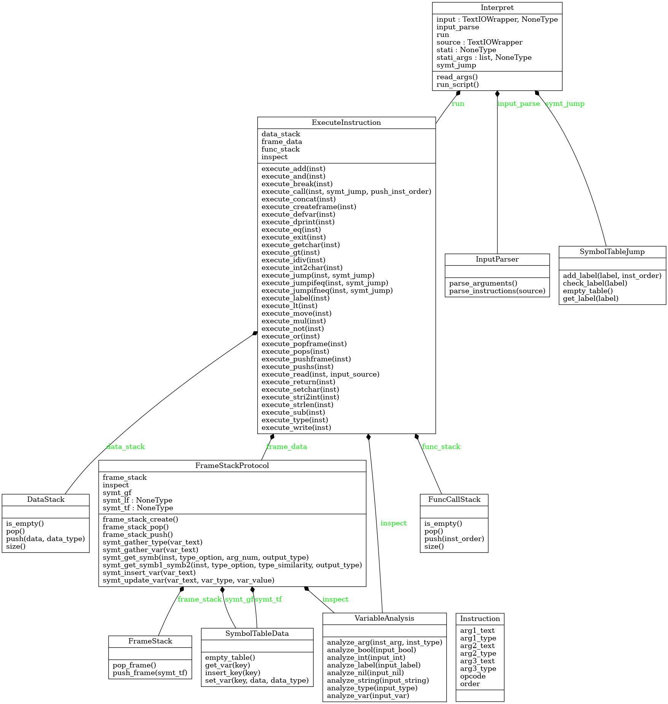
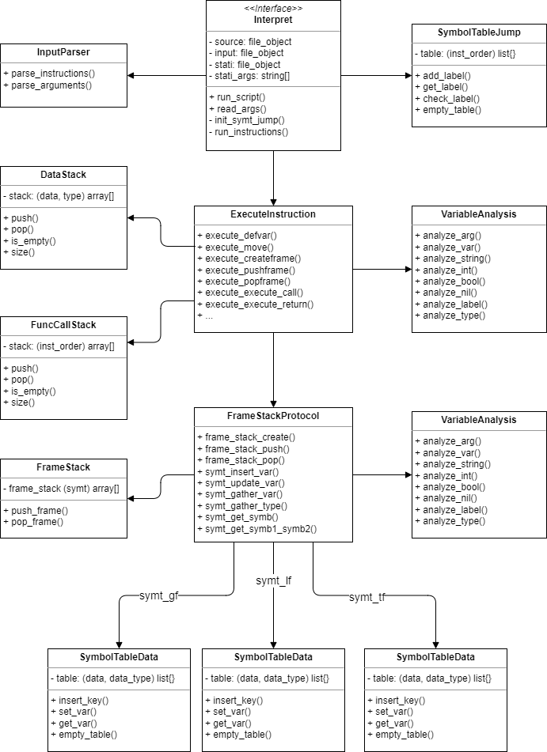

**Implementační dokumentace k 2. úloze do IPP 2022/2023**

**Jméno a příjmení:** Nikolas Nosál

**Login:** xnosal01

# Introduction

This document provides instructions for using interpret.py, interpret which executes ippcode23.xml.
In this document are also notes of how the Interpret works and the design process/principles.

Interpret is meant to be used in combination with script parse.php.
Script parse.php is script which takes in raw ippcode and transforms it onto ippcode23.xml file.

## Requirements
To use this script, you will need:

- Python 3.10 installed in your system
- XML (ippcode23) file which has been created by the script parse.php which parsed raw ippcode23 file

## Input/Output

***Input*** - Interpret script has two input sources which are set by arguments, (--source=<file>.xml) and (--input=<file>).
 - If one of these arguments is not set than the (--source) or (--input) is set as default, (stdin)
 - If none of these arguments is set then the interpret (won't start)

***Input arguments***
- (--source) - is the (XML ippcode23), file which will be executed by the interpret 
- (--input) - is the interpret input from which can user of the interpret interact while the interpret is running

***Output*** - Interpret has one main output which is (stdout). This output is set by defalut and can't be changed

## Usage

Here are examples of how to use the interpret.

The default, in this case the interpret.py executes ippcode23.xml file, and all print messages sends to stdout. Users can interact with the interpreter through stdin.
 - source = ippcode23.xml, input = stdin, output = stdout
    
    $ interpret.py --source=ippcode23.xml

In this case the interpret.py executes source from stdin and and all print messages sends to stout. Users can't interact with the Interpret. When instruction READ appears in the source, the interpret will just read the line in the file.txt
 - source = stdin, input = file.txt, output = stdout
    
    $ interpret.py --input=file.txt
       

# Design of the Interpret
The Interpreter is designed using object-oriented programming (OOP), mainly through composition. The classes that make up the interpret.py file include:

 - Interpret           - Manager class which runs the interpret 
 - InputParser         - Parses XML and interpret.py input
 - VariableAnalysis    - Checks if the variables have correct type and syntax
 - ExecuteInstruction  - Execute given instruction
 - FrameStackProtocol  - Interface for working with frames
 - FrameStack          - Implementation of stack with frames
 - SymbolTableData     - Class which represent an individual frame and is implemented as a symbol table
 - DataStack           - Stack witch var data and type
 - FuncCallStack       - Stack with instruction label numbers/pointers
 - SymbolTableJump     - Symbol table of instruction numbers/pointers that is accessed by label name/key

Together these classes for a compositional hierarchy which is illustrated in the diagrams below. 

### Class diagram of interpret.py generated by pyreverse

   

### Instance of objects while interpret.py is running

   

# Other design aspects of the design
Here are described other important design decision of interpret.py. 

### Instruction class
The InputParser class has the ability to create an Instruction object, which serves more as a data structure or C-struct than a traditional class. Its main purpose is to store instruction data such as opcodes, order, and arguments. Therefore, while the Instruction class is depicted in the class diagram, it functions more like a container for instruction data than a typical class.
    

### Semantic checks
Interpret reads and checks instruction data line by line which means. This is done to correctly implement interactivity of instruction READ and make the Interpret more versatile/reactive. For instance, if the input code contains invalid instructions, such as referencing an undefined variable like LF@unknown the interpret will still print data to stdout. Of course the interpret will also print error mesage and exits with error code.

**Example:** - (source) code.xml

    DEFVAR GF@test 
    MOVE GF@test int@5
    WRITE GF@test
    WRITE string@Hello
    WRITE LF@unknown

**Result:** - (stdout) terminal
    
    $ interpret.py --source=code.xml
    5
    Hello
    [interpret.py] - ERROR (54) - SymbolTableData - set_var()

    $ echo $?
    54
 

### Possible expansions

If wanted here are some ways to expand the interpret.py

 - **adding new instructions** - this can be done easily in form of adding new instruction methods in ExecuteInstruction class and then adding them into instruction list which is in method run_instruction()

 - **adding new data types** - this can be done by adding the new-type and new-type methods in VariableAnalysis and FrameStack protocol. Also, the Interpret is strict about its types so error checking in InputParser must be also changed.

 - **adding even more instruction arguments** - for this to be done the InputParser class must be rechanged for this purpose. This change will not affect how the other classes work.

   

# Description of Interpret-Class

This class is the main class of the interpret.py script and is the interface for the user. The user can use the Interpret class to interpret the XML source file.

### Dependencies
The Interpret class depends on the following classes:
 - **InputParser class**            - used for parsing files and interpret.py arguments
 - **ExecuteInstruction class**     - used for executing individual instruction
 - **SymbolTableJump class**        - used for enabling jumps in the sym_table

### Attributes
- **source (File)** - the source file. The default value is sys.stdin.
- **input (File)**  - the input file. The default value is None.

### Methods

**read_args(self)**
 - This public method reads the interpret.py arguments from the command line. The method sets up the source file, input file, stati file, and stati arguments. This function doesn't need to be called by the user if they don't want to read the arguments.

**run_script(self)**
 - This public method runs the interpret.py script, interprets the source file, and executes the instructions.

**init_symt_jump(self, symt_jump)**
 - This method initializes the symt_jump class and saves the position of every label in the source file, which is later used for JUMP type instructions.

**run_instructions(self, inst)**
 - This method executes every instruction in the array of instructions and calls the appropriate method for every instruction.

### Usage as an interface 
To use the Interpret class, you can create an instance of it and call its read_args() method to read the arguments from the command line. You can then call the run_script() method to interpret the source file.

Here is an example of how to implement interpret ippcode23 in your python code.

    interpret = Interpret()
    interpret.read_args() 
    interpret.run_script()
   

# Detailed description other of classes

## InputParser Class
The InputParser class is used for parsing source code and instructions. It encapsulates the parsing capabilities of interpret.py.

### Classes
- **Instruction Class** - This is a nested class that contains all the information about instruction. It is used for easier access to the instruction data, used like a C-like structure.

### Methods

- **parse_instructions(self, source):** - parses the xml file and saves the instructions into a list of Instruction class
    - method returns the list of instructions

- **parse_arguments(self):** - parses the arguments from the command line, uses the argparse library
    - method returns the interpret.py arguments as (source_file, input_file, stati_file, stati_args[])
     

## VariableAnalysis Class
Class is used for checking the value of a variable, if the type correspond to its value. Class encapsulates regexes and other important type checks for the interpret.py. VariableAnalysys has also value-decoding capabilities, for example analyze_string decodes the given string value.

### Main Analyze-Methods
These are the main methods which are used in the interpret.py
- **analyze_arg(inst_arg, inst_type):** - analyzes the given variable with the given type, returns the variable scope if var and value
- **analyze_var(input_var):**           - analyzes the given variable name/scope, returns the variable scope and value

### Specific Analyze-Method
These methods are for specific value-check.

= methods have syntax, [analyze_type(string: value)] and return the value that has been checked/decoded

- **analyze_string():**         - analyzes and decode string value
- **analyze_int():**            - analyzes int value
- **analyze_bool():**           - analyzes bool value
- **analyze_nil():**            - analyzes nil value
- **analyze_label():**          - analyzes label, value
- **analyze_type():**           - analyzes type value
     

## ExecuteInstruction Class
Class where methods are used to execute instructions one by one. Every method has instruction as an argument -> Instruction class object which is then executed by the method. To note class and object diagrams above don't show (STACK extension) - execute_<instruction> methods.

### Dependencies
- **DataStack class**             - used to store data in stack -> PUSHS, POPS
- **FuncCallStack class**         - used to store jump addresses in stack -> CALL, RETURN
- **FrameStackProtocol class**    - used to store data in frames -> CREATEFRAME, DEFVAR, MOVE
- **VariableAnalysis class**      - used to check/decode variables -> STRLEN, JUMP

### Atributes
- **data_stack**        - ref. to DataStack class which is used to for storing variables into a stack
- **func_stack**        - ref. to FuncCallStack class which is used for saving jump (instruction order)
- **frame_data**        - ref. to FrameStackProtocol class which is used to work with frames
- **inspect**           - ref. to VariableAnalysis class which analyzes/decodes variable values 

### Instruction Methods
Methods which represent basic instruction opcode. These methods need only instruction data to be executed and don't return anything. 

= methods have syntax, [ execute_instruction(ref: instruction) ]

- **execute_defvar()**: - saves the variable name/tag into the var frame
- **execute_move():** - moves the value of the second argument into the variable    
- **execute_createframe():** - creates a new temporary frame
- **execute_pushframe():** - pushes the temporary frame to the stack
- **execute_popframe():** - pops the top frame from the stack
- **execute_pushs():** - pushes the symb and type to the stack
- **execute_pops():** - pops the symb and type from the stack and updates the variable
- **execute_add():** - adds (int) the symb1 and symb2 and updates the variable with the result
- **execute_sub():** - subtracts (int) the symb1 and symb2 and updates the variable with the result
- **execute_mul():** - multiplies (int) the symb1 and symb2 and updates the variable with the result
- **execute_idiv():** - divides (int) the symb1 and symb2 and updates the variable with the result
- **execute_lt():** - compares the symb1 and symb2 and updates the variable with lt result (bool)
- **execute_gt():** - compares the symb1 and symb2 and updates the variable with gt result (bool)
- **execute_eq():** - compares the symb1 and symb2 and updates the variable with eq result (bool)
- **execute_and():** - used and operator on the symb1 and symb2 and updates the variable with the result (bool)
- **execute_or():** - uses or operator on the symb1 and symb2 and updates the variable with the result (bool)
- **execute_not():** - negates the symb and updates the variable with the result (bool)
- **execute_int2char():** - converts the symb to char and updates the variable with the result (char)
- **execute_stri2int():** - converts the symb to int and updates the variable with the result (int)
- **execute_write():** - writes the symb to stdout
- **execute_concat():** - concatenates two strings and updates the variable with the result
- **execute_strlen():** - gets the length of the string and updates the variable with the result
- **execute_getchar():** - gets the char from the string at the given index and updates the variable with the char
- **execute_setchar():** - sets the char at the given index in the string to the given char
- **execute_type():** - gets the type of the variable and updates the variable with the result type in string format
- **execute_label():** - does nothing, just checks if the label is defined correctly
- **execute_exit():** - exits the program with the given exit code
- **execute_dprint():** - prints the value of the given variable to the stderr

### Stack Methods
Methods which execute more comple stack instructions, they are basically the same as the above mentioned but take data from stack (symb1, symb2). The result is then pushed back to stack 

= methods have syntax, [ execute_instruction(ref: instruction) ]

- **execute_clears** - (STACK) clears the stack
- **execute_adds** - (STACK) add inst.
- **execute_subs** - (STACK) sub inst.
- **execute_muls** - (STACK) mul inst.
- **execute_idivs** - (STACK) idiv inst.
- **execute_lts** - (STACK) lts inst.
- **execute_gts** - (STACK) gts inst.
- **execute_eqs** - (STACK) eqs inst.
- **execute_ands** - (STACK) ands inst.
- **execute_ors** - (STACK) ors inst.
- **execute_nots** - (STACK) nots inst.
- **execute_int2chars** - (STACK) int2char inst.
- **execute_stri2ints** - (STACK) stri2ints inst.

### Jump Methods
Methods which represent jump instruction. These methods need instruction data and SymbolTableJump class as parameters. Methods return instruction order which points instruction which should be read next. 

= methods have syntax, [execute_instruction(ref: instruction, ref: symt_jump) ]

- **execute_jump():** - jumps to the given label
- **execute_jumpifeq():** - jumps to the given label if the two variables are equal
- **execute_jumpifneq():** - jumps to the given label if the two variables are not equal

### Jump Stack Methods
Methods which execute jumps but with data stored in stack. These methods get symb1, symb2 data from the stack and the label is written in the instruction argument.

- **execute_jumpifeqs** - (STACK) jumpifeqs inst.
- **execute_jumpifneqs** - (STACK) jumpifneqs inst.

### Special-Instruction Methods
Methods which represent instruction which are special and can't be grouped. Every instruction has different parameters and returns different values.

- **execute_call(instruction, symt_jump, instruction order):** - function call, method takes current (instruction order) and saves it to the stack. Then it and jumps to the given label
    -  returns the new (instruction order)
- **execute_return(instruction):** - function return, pops the instruction order from the function-stack and jumps to the instruction order
    - returns the new (instruction order)
- **execute_break(instruction):** - prints information about the current state of the program
    - returns call to print Interpret data
- **execute_read(instruction, self.input):** - reads the input from input parameter and updates the variable with the result (int, bool, string, nil)
     

## FrameStackProtocol Class
Interface for communicating with data-frames and data-stack. Class includes methods for easy manipulation of the frames and for inserting/gathering variables from the frames.

### Dependencies:
- **FrameStack class**          - used for saving the symtables into the frame-stack
- **SymbolTableData class**     - used for saving the variables into individual frames
- **VariableAnalysis**          - used for controlling values of variables

### Atributes
- **frame_stack**       - ref. to FrameStack class which stores frames in stack
- **global_frame**      - ref. to SymbolTableData class which is used as global frame
- **temporary_frame**   - ref. to SymbolTableData class which is used as temporary_frame
- **local_frame**       - ref. to SymbolTableData class which is used as local_frame
- **inspect**           - ref. to VariableAnalysis class which analyzes/decodes variable values 

### Frame-Stack Methods
Methods used for frame-stack manipulation.
- **frame_stack_create():** - creates temporary frame
- **frame_stack_push():**   - pushes temporary frame into the frame-stack
- **frame_stack_pop():**    - pops the head of the frame-stack
 
### Frame Methods
Methods used for individual frame manipulation. 
- **symt_insert_var(var_text):** - inserts variable into the frame
- **symt_update_var(var_text, var_type, var_value):** - updates variable in the frame
- **symt_gather_var(var_text):** - finds variable in the frame depending on the var_text and returns its value and type
- **symt_gather_type(var_text):** - finds variable type from the frame depending on the var_text and returns its type (doesn't do any type checking)

### Execute-Instruction Methods
Methods created specially for use in ExecuteInstruction class. Used for easy access to the symbol table and instruction.
- **symt_get_symb(instruction, type_option, arg_num, output_type):** - gets symb from the symbol table or instruction and returns its value and type

    - ***(string: type_options)*** - Which type of variable value is accepted
        - universal - any type
        - string - str type
        - integer - int type
        - boolean - bool type

    - ***(string: arg_num)*** - Which argument of given instruction should be read/checked
        - arg1 - first argument
        - arg2 - second argument
        - arg3 - third argument

    - ***(string: output_type)*** - How the variable value should be returned
        - raw       - returns the original data -> <string> = "/065/032/066"
        - decoded   - returns the decoded data -> <string> = "A B"
   

- **symt_get_symb1_symb2(instrutcion, type_option, type_similarity, output_type):** - gets symb1 and symb2 from the symbol table or 
instruction and returns their value and type
    
    - ***(string: type_options)*** - Which types of variables are accepted
        - arithmetic    - (int, int)
        - logical       - (bool, bool)
        - relational    - (string-int-bool, string-int-bool)
        - jump          - (string-int-bool-nil)
        - string_int    - (string-int)
        - int_string    - (int-string)
        - concat        - (string-string)
    
    - ***(string: type_similarity)*** - Similarity of accepted variable type
        - "same"        - variable type must be same
        - "different"   - variable type can be different      
    
    - ***(string: output_type)*** - How the variable value should be returned 
        - "raw" -> returns the original data -> <string> = "/065/032/066"
        - "decoded" -> returns the decoded data -> <string> = "A B"
     

## FrameStack Class
Implements the frame stack which is used to store local and temporary frames. The important thing to remember is that the frame is a reference to SymbolTableData class. This is the data stored in the stack. Stack accessible only through class methods

### Atributes 
- **frame_stack** = stack is implemented as python list with the following structure: [(ref: class SymbolTableData)]

### Methods
- **push_crame(temporary_frame):** - pushes given frame/sym-table to stack
- **pop_frame():** - pops the frame from the stack, returns head of the frame and popped frame which both are [(ref: class SymbolTableData)]
     

## SymbolTableData Class
Implements symbol table data structure which is used by FrameStackProtocol class to store variable. The Frame represents the class SymbolTableData. The table is only accessible through class methods.

### Atributes 
- **table** - table is implemented as python dictionary with the following structure: {key: (string: value, string: type)}

### Methods
- **insert_key(key):** - insert the key and nothing else
- **set_var(key, data, data_type):** - inserts or replaces the value and the type of the key
- **get_var(key):** - return the value and the type of the key
- **empty_table():** - clears the hash table
     

## DataStack:
Implementation of stack which stores data with its data type which is used by stack instructions. The stack is only accessible through class methods.

### Atributes 
- **stack** - stack is implemented as python list with the following structure: [(string: data, string: type)]

### Methods
- **push(data, data_type):** - pushes the data and the type to the stack
- **pop():** - pops the data and the type from the stack, returns [(string: data, string: type)]
- **is_empty():** - returns True if the stack is empty, returns (true/false)
- **size():** - returns the size of the stack returns (int: size)
- **clear()** - clears the stack
     

## FuncCallStack Class
Implementation of stack which stores instruction order which tells instructions CALL, RETURN where to jump. The stack is only accessible through class methods.

### Atributes 
- **stack** - stack is implemented as python list with the following structure: [(int: instruction_order)]

### Methods
- **push(inst_order):** - push the (instruction order) to the stack
- **pop():** - pop the instruction order from the stack, returns popped (instruction order)
- **is_empty():** - check if the stack is empty, returns (true/false)
- **size():** - get the size of the stack, returns (int size)
     

## SymbolTableJump Class
Implements symbol table which is used to store labels and their instruction order. The table is only accessible through classes methods. 

### Atributes
- **table** - table is implemented as python dictionary with the following structure: {label: int: instruction_order}  

### Methods
- **add_label(label, inst_order):** - adds instruction order to the table based on its label
- **get_label(label):** - gets labels inst_order from the table
- **check_label(label):** - checks if label exists in the table
- **empty_table():** - clears the symbol table
 
